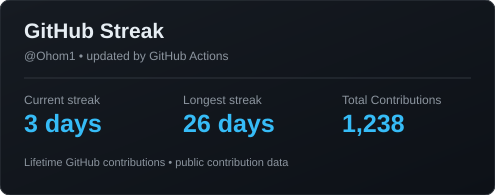

# 👨‍💻 Omkarnath Dubey

  <b>Full Stack Developer &bull; AI Automation Engineer &bull; SaaS Builder &bull; Enterprise Web Developer</b>

  <i>Building production-ready web platforms, AI-powered applications, and enterprise systems that solve real-world business problems.</i>

  
  
  
  
  

---

## 📌 About Me

- **Full-Stack Engineering:** Specializing in building scalable, production-grade web applications and SaaS platforms with Next.js, React, Node.js, and TypeScript.
- **End-to-End Delivery:** Experienced across the complete software development lifecycle — from frontend architecture and RESTful APIs to database modeling, security, and cloud deployment.
- **Enterprise & AI Solutions:** Hands-on expertise engineering B2B enterprise portals, business process automation systems, and Google Gemini AI integrations.
- **Mobile Development:** Skilled in developing native Android applications using Java, MVVM architecture, background services, and hardware/sensor APIs.

---

## 🏛️ Engineering Focus & Core Competencies

- **Scalable Web & API Architecture:** Designing modular Next.js and Node.js applications with secure REST APIs and clean separation of concerns.
- **Security & Authorization:** Implementing robust authentication mechanisms, role-based access control (RBAC), Argon2id cryptographic password hashing, and server-side session protection.
- **Payment & Transaction Pipelines:** Integrating payment workflows with server-side validation, signature verification, and idempotent webhook handling.
- **AI Integrations & Automation:** Embedding Google Gemini SDK for intelligent voice transcription, complaint triage, and context-aware RAG documentation assistants.
- **Database Architecture & Optimization:** Schema design, relational integrity, migrations, and query tuning across PostgreSQL, MySQL, MongoDB, and Prisma ORM.

---

## 🛠️ Technical Stack

| Domain | Technologies |
| :--- | :--- |
| **Languages** |         |
| **Frontend** |     |
| **Backend & APIs** |    |
| **Databases & ORM** |     |
| **AI, Cloud & DevOps** |       |

---

## 🚀 Featured Projects

### 🏢 [Adhya Enterprises](https://www.adhyaenterprises.online/) — Business Management & Digital Operating Platform
> Production-ready enterprise web platform designed to digitize business operations, quotations, customer lifecycles, and billing workflows.

- **Architecture & Security:** Multi-role architecture featuring role-based access control (RBAC), Argon2id cryptographic password hashing, and server-side protected route middleware.
- **Workflow & Transactions:** End-to-end customer and billing lifecycle with server-side validation and idempotent, webhook-verified payment processing.
- **Client Experience:** Dedicated customer portal with quotation approval, invoice tracking, and automated status notifications.
- **Tech Stack:** `Next.js` &bull; `TypeScript` &bull; `React.js` &bull; `Tailwind CSS` &bull; `Node.js` &bull; `PostgreSQL` &bull; `Prisma ORM` &bull; `Argon2id` &bull; `Vercel`

---

### 🏗️ [FixCon](https://devendra-portfolio-gold.vercel.app/) — Industrial Engineering & Product Platform
> Enterprise-facing B2B digital platform engineered for an industrial engineering and construction chemical solutions business.

- **Catalog Architecture:** Modular product discovery and catalog architecture showcasing deep technical specifications across application categories.
- **Resource Management:** Centralized repository for compliance assets, case studies, project showcases, and TDS/MSDS technical documentation.
- **Design & Performance:** Scalable component-driven UI architecture delivering responsive experiences for mobile, tablet, and desktop enterprise audiences.
- **Tech Stack:** `Next.js` &bull; `React.js` &bull; `JavaScript` &bull; `Tailwind CSS` &bull; `Responsive UI` &bull; `Vercel`

---

### 🏙️ [Panchayat Mobile App](https://app.adhyaenterprises.online/) — AI-Powered Smart Society Platform
> Community management and automation platform designed to digitize day-to-day residential society administration and resident services.

🔗 **[Live Website](https://app.adhyaenterprises.online/)**

- **AI Voice Complaints:** Integrated Google Gemini SDK for automated voice recording, speech-to-text transcription, and intelligent category classification.
- **RAG Support Assistant:** Built an AI-powered society assistant grounded in society-specific bylaws, operational rules, and FAQs.
- **Operations & Communication:** Implemented OTP/QR-based visitor management, UPI billing workflows, and Firebase real-time alerts.
- **Tech Stack:** `Java` &bull; `Android SDK` &bull; `MVVM` &bull; `Node.js` &bull; `Express.js` &bull; `MongoDB` &bull; `Google Gemini SDK` &bull; `Firebase`

---

### 🛡️ Spark Women — GPS-Based Emergency Response App
> Android personal safety and emergency-response application designed for rapid alert generation and real-time coordinate sharing.

- **Shake-to-Alert:** Hardware accelerometer-driven emergency detection running continuously through a persistent Android background service.
- **Location Processing:** Real-time GPS coordinate acquisition paired with reverse geocoding for immediate street-address resolution.
- **Resilience:** Automated SMS and call triggers via Android Telephony Manager with local data caching in SQLite for offline reliability.
- **Tech Stack:** `Java` &bull; `Android SDK` &bull; `SQLite` &bull; `Accelerometer API` &bull; `GPS & Geocoding` &bull; `Telephony Manager`

---

### 🏠 Real Estate CRM & Listing Engine
> Business automation platform designed for property inventory management, sales pipeline tracking, and client lifecycle operations.

- **Inventory & Leads:** End-to-end property listing lifecycle management and prospective buyer lead tracking.
- **Operational Analytics:** Interactive business analytics dashboards visualizing sales velocity, lead conversion, and property metrics.
- **Administrative Control:** Secure administrative controls with role-specific data access and workflow management.
- **Tech Stack:** `Next.js` &bull; `JavaScript` &bull; `Tailwind CSS` &bull; `Chart.js` &bull; `REST APIs`

---

## 📊 GitHub Activity

  

---

## 💼 Professional Experience

### NextGen Vidhya Pvt Ltd
**Web & Software Developer** | *June 2023 – October 2025*

- Developed and maintained scalable web applications and software solutions across frontend and backend layers.
- Translated business and client requirements into reliable, maintainable technical implementations.
- Worked on application architecture, RESTful API integrations, and database interactions.
- Optimized application performance, UI responsiveness, and code quality across production environments.

---

### Independent Software Developer
**Full Stack & Product Engineer** | *2023 – Present*

- Architected, developed, and deployed full-stack web platforms, SaaS solutions, and mobile apps for clients.
- Built production-ready systems using **React.js, Next.js, Node.js, TypeScript, PostgreSQL, MongoDB, and Java**.
- Engineered secure authentication, role-based authorization, REST APIs, database schemas, and payment integrations.
- Integrated AI capabilities with **Google Gemini SDK** for automated classification, voice pipelines, and contextual assistants.

---

## 🎓 Education

**Bachelor of Science — Information Technology (B.Sc. IT)**  
*University of Mumbai* &bull; *2023*

---

## 📜 Certifications & Honors

### Certifications
- **Artificial Intelligence Fundamentals** — Great Learning
- **Java Programming** — Great Learning
- **Frontend Development** — Great Learning
- **100 Days of Code: Python** — Udemy
- **AWS for Beginners** — Great Learning

### Honors & Recognition
- 🥇 **Meena Ratna Student Award (2012)** — State Government recognition for academic excellence.
- 🔬 **Science Exhibition Award** — District-level recognition for innovative project design.
- 🌍 **International Multidisciplinary Conference** — Contributor to cross-domain technical discourse.

---

## 🌐 Connect & Collaborate

I am always interested in discussing new software projects, SaaS architecture, AI automation, and technical opportunities.

  
  
  
  
  

